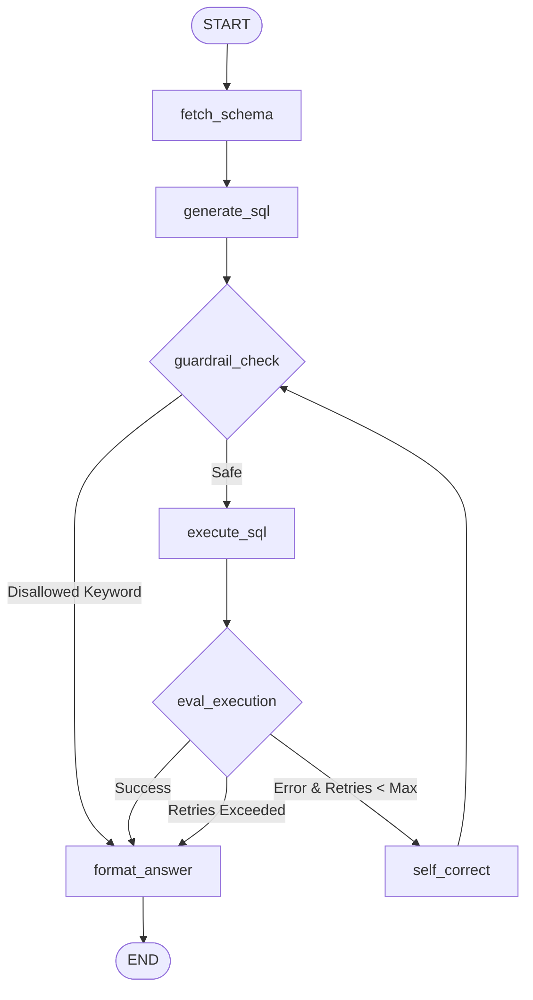

# 04 - Self-Healing SQL Agent

Demonstrates a stateful, guardrail-protected SQL agent in LangGraph:
- Dynamic schema introspection against SQLite.
- SQL query formulation with guardrails (blocking `DROP`, `DELETE`, `UPDATE`).
- Automated error recovery and self-healing loop (re-prompting/rewriting queries on SQL syntax or schema errors).
- Clean result synthesis into natural language `AIMessage`.

## Architecture



## Run

```bash
python -m examples.ex04_sql_agent.main
```
or
```bash
make run-sql
```
